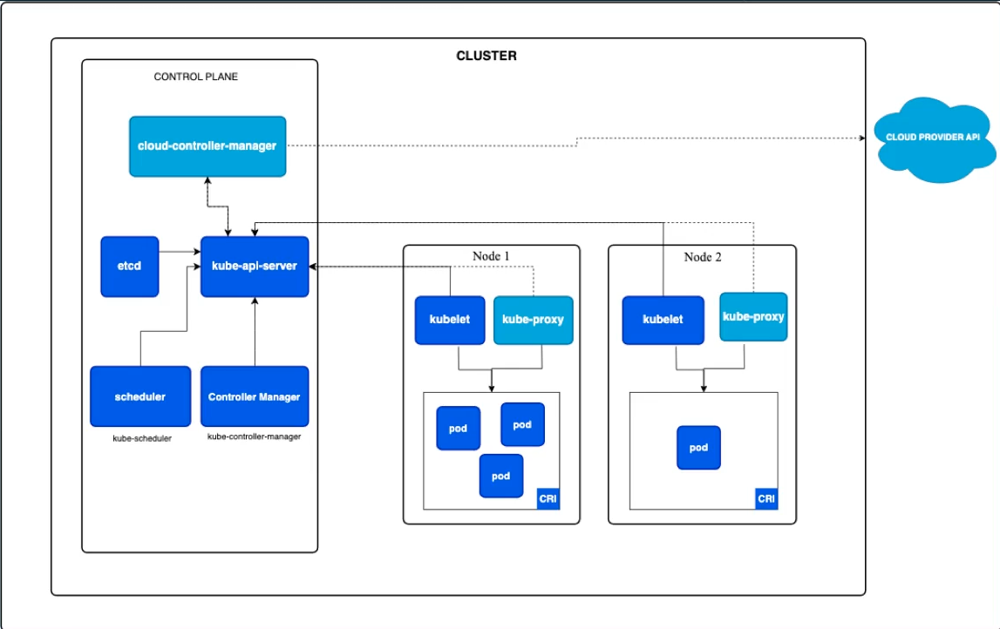

# Introdução ao Kubernetes

Kubernetes é uma plataforma de orquestração de contêineres de código aberto originalmente desenvolvida pela Google e agora mantida pela Cloud Native Computing Foundation (CNCF). Ele facilita a automação, implantação, escalonamento e gerenciamento de aplicações em contêineres, proporcionando uma infraestrutura robusta e flexível para ambientes de produção.

## Principais Características
1.	**Orquestração de Contêineres:** Kubernetes gerencia a distribuição e o agendamento de contêineres em um cluster de máquinas, garantindo que as aplicações estejam sempre disponíveis e funcionando conforme o esperado.
2.	**Escalabilidade Automática:** Permite escalar aplicações vertical e horizontalmente com base na demanda, garantindo desempenho consistente mesmo sob cargas variáveis.
3.	**Auto-recuperação:** Detecta falhas em contêineres, nós ou aplicações e automaticamente reinicia, substitui ou redistribui recursos para manter a integridade do sistema.
4.	**Gerenciamento de Configuração e Segredos:** Facilita o gerenciamento de configurações de aplicação e dados sensíveis de forma segura e eficiente, separando-os do código da aplicação.
5.	**Serviços de Rede e Balanceamento de Carga:** Kubernetes fornece mecanismos integrados para comunicação entre contêineres e balanceamento de carga, garantindo que o tráfego seja distribuído de maneira equilibrada entre as instâncias de aplicação.!
## Componentes Principais
* **Cluster:** Conjunto de máquinas (físicas ou virtuais) que executam aplicações em contêineres.
* **Master Node:** Controla e gerencia o cluster, tomando decisões como agendamento de contêineres e manutenção do estado desejado.
* **Worker Nodes:** Hospedam os contêineres das aplicações, executando os workloads definidos.
* **Pods:** Unidade básica de implantação no Kubernetes, que encapsula um ou mais contêineres que compartilham recursos de rede e armazenamento.
* **Services:** Abstrações que definem como acessar os pods, facilitando a comunicação interna e externa.

## Arquitetura

* **API Server:** O kube-api-server é o principal componente do plano de controle. Ele expõe a API do Kubernetes, permitindo que os usuários e os componentes internos se comuniquem com o cluster. Todas as operações (como criar, ler, atualizar e deletar recursos) passam por ele. Ele autentica e valida solicitações, e as grava no armazenamento central do etcd.
* **etcd:** O etcd é um armazenamento chave-valor distribuído utilizado para manter o estado de todo o cluster de forma consistente. Ele armazena todos os dados de configuração, estado e metadados do Kubernetes, garantindo alta disponibilidade e resiliência.
* **Scheduler:** O kube-scheduler é responsável por designar os pods aos nodes. Ele decide em qual node um pod deve ser executado, levando em consideração critérios como capacidade de recursos, políticas de afinidade e localização, e garantias de qualidade de serviço.
* **Controller Manager:** O kube-controller-manager gerencia uma série de controladores que monitoram o estado do cluster e tomam ações para garantir que o estado real corresponda ao estado desejado. Exemplos de controladores incluem o Node Controller (que monitora a disponibilidade dos nodes), o Replication Controller (que garante que um número especificado de pods esteja rodando), e outros controladores que lidam com volume, endpoints, etc.
* **Cloud Controller Manager:** O cloud-controller-manager interage com APIs de provedores de nuvem, quando aplicável. Ele gerencia recursos como balanceadores de carga, volumes de armazenamento e outros serviços fornecidos pela nuvem, integrando o Kubernetes com infraestruturas de nuvem pública.

### Componentes dos Nodes

* **Kubelet:** O kubelet é um agente executado em cada node do cluster. Ele garante que os contêineres dos pods estejam rodando conforme especificado nos manifestos de pod. O kubelet monitora o estado dos contêineres e se comunica com o API Server para reportar a saúde e o status do node.
* **Kube-proxy:** O kube-proxy é responsável pela rede em cada node. Ele mantém as regras de rede para permitir a comunicação entre os serviços e os pods no cluster. Ele gerencia a rotação de endereços IP e o balanceamento de carga entre as diferentes instâncias de um serviço.
* **Pods:** O Pod é a menor unidade de execução no Kubernetes. Ele pode conter um ou mais contêineres que compartilham recursos de rede e armazenamento. Os pods são criados e gerenciados pelo Kubernetes, e os contêineres dentro de um pod compartilham o mesmo ciclo de vida.
* **Container Runtime Interface (CRI):** A CRI é responsável pela execução dos contêineres nos nodes. Kubernetes suporta diversos runtimes, como o Docker e o containerd, que são responsáveis por baixar a imagem do contêiner, iniciar e parar os contêineres e reportar seu status para o kubelet.

## Benefícios:
* **Portabilidade:** Suporta múltiplos ambientes de nuvem e infraestrutura on-premises, permitindo flexibilidade na escolha de provedores.
* **Eficiência:** Otimiza o uso de recursos, garantindo que as aplicações utilizem a capacidade disponível de forma eficaz.
* **Comunidade e Ecossistema:** Possui uma vasta comunidade ativa e um ecossistema rico de ferramentas e extensões que ampliam suas funcionalidades.

## Container Runtime vs. Container Image

1. **Container Runtime:** É o software responsável por rodar containers. No Kubernetes, o container runtime gerencia a execução dos containers, gerencia a interface com o kernel do sistema operacional e faz a comunicação com o resto do cluster Kubernetes. Alguns exemplos de container runtimes são containerd, CRI-O, e outros.
2. **Container Image:** É o pacote contendo a aplicação e todas as suas dependências, bem como as instruções para como ela deve ser executada em um container. As imagens geralmente são criadas usando ferramentas como o Docker ou Podman.

### Docker como Container Runtime no Kubernetes

O Kubernetes utilizava o Docker como container runtime no passado, mas houve uma mudança. A partir do Kubernetes 1.20, o suporte ao Docker como container runtime foi deprecado, e no Kubernetes 1.22, ele foi oficialmente removido. Isso aconteceu porque o Docker não implementa a interface Container Runtime Interface (CRI), que o Kubernetes requer para comunicação com os runtimes de containers. Em vez disso, o Kubernetes agora usa runtimes que são compatíveis com CRI, como o containerd (que é, curiosamente, a camada de baixo nível que o Docker também usa para rodar containers) ou CRI-O.

## ??
`docker ps -a`
`docker start <nome do container || id do container>`
